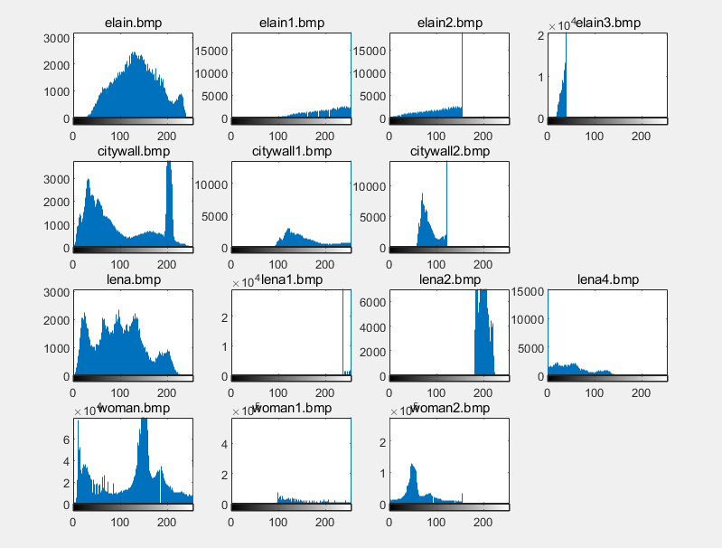
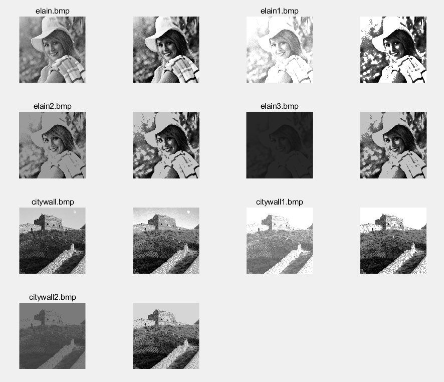
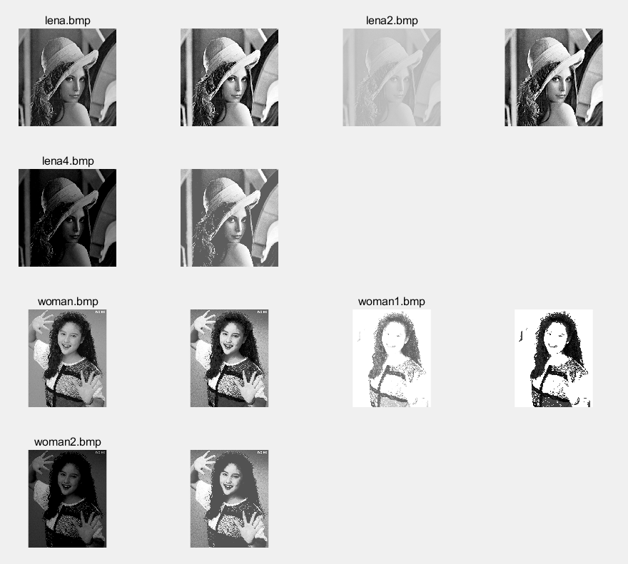
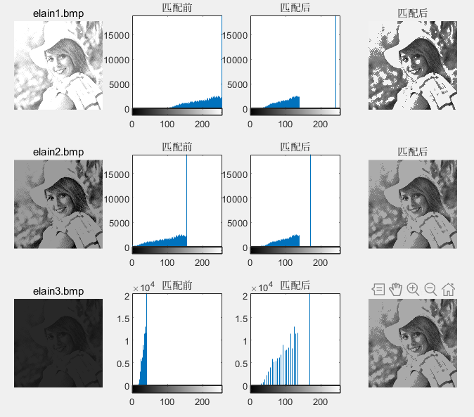
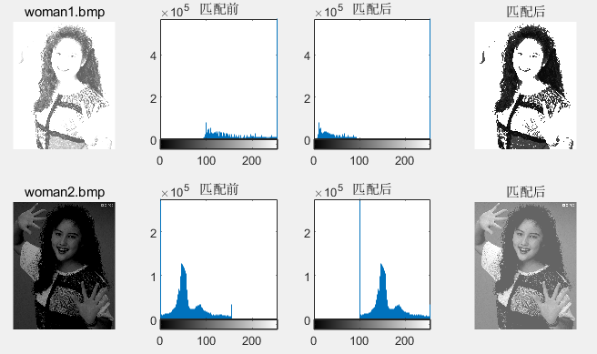
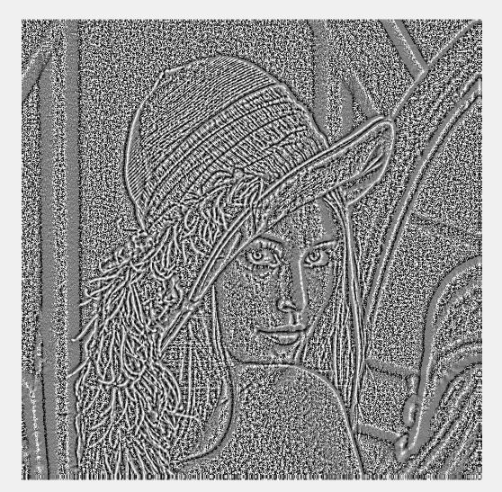
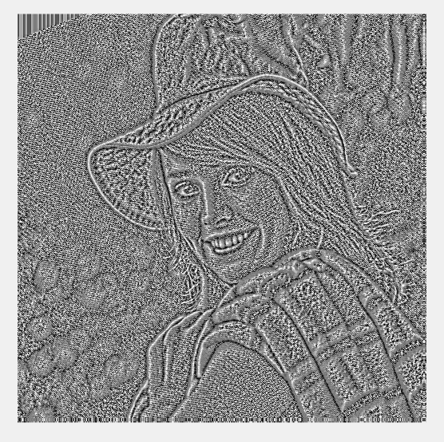

 
 
 
# 数字图像处理课程作业实验三 直方图图像增强

**张程博昊**

**自动化64**

**2160504106**

**2019年3月11日**

 

## 摘要

这次实验实验主要采用了各种直方图处理方法，实验环境为MATLAB。使用其中函数，完成了对附件中图像进行直方图显示、直方图均衡、指定直方图增强、直方图局部增强、直方图分割等功能。

 

## 实验内容

### 1.绘制图像的直方图

直方图是多种空间域处理技术的基础。直方图操作在软件中计算简单，已经成功为图像处理的流行工具。在matlab中，可以采用imhist()函数可以得到图像的直方图。对附件中文件，可以将图片通过ind2gray函数以索引图片的形式读入并显示。

### 2.把所有图像进行直方图均衡；输出均衡后的图像和源图像进行比对；并分析改善内容

直方图均衡化是指将原图像采取某种变换，得到一幅灰度直方图为均匀分布的新图像的方法，这样增加了像素灰度值的动态范围，从而达到增强图像整体对比度的效果。在MATLAB中可以采用histeq()函数对图像进行直方图均衡操作。

 
 
 

**改善内容：**
通过对比图像均衡前后的图像可以看出经直方图均衡后的图像对比度更高。

 

### 3.进一步把图像按照对源图像直方图的观察，各自自行指定不同源图像的直方图，进行直方图匹配，进行图像增强；

直方图匹配又称为直方图规定化，是指将一幅图像的直方图变成规定形状的直方图而进行的图像增强方法。可以采用imhist()函数，并采取原图像为模板。得到结果如下：

 
 
 
 
 

### 4.对elain和lena图像进行7*7的局部直方图增强；
这里采用7*7的局部直方图增强，对每个分块进行直方图匹配，在此之前首先应当对图像进行扩展，否则无法对每个像素进行处理，处理结果如下：

 
 
 

### 5.利用直方图对图像elain和woman进行分割；
本任务需要基于直方图进行图像分割，这里采用基于阈值的图像（最大类间方差法--OTSU），matlab中graythresh()函数利用该方法找到一个阈值，配合im2bw()函数即可将图像转变为二值图像。图像分割的结果为：

 
 
 

## 附录

代码详见文件

 

## 参考文献

[1] 冈萨雷斯, 数字图像处理（第三版）, 电子工业出版社

